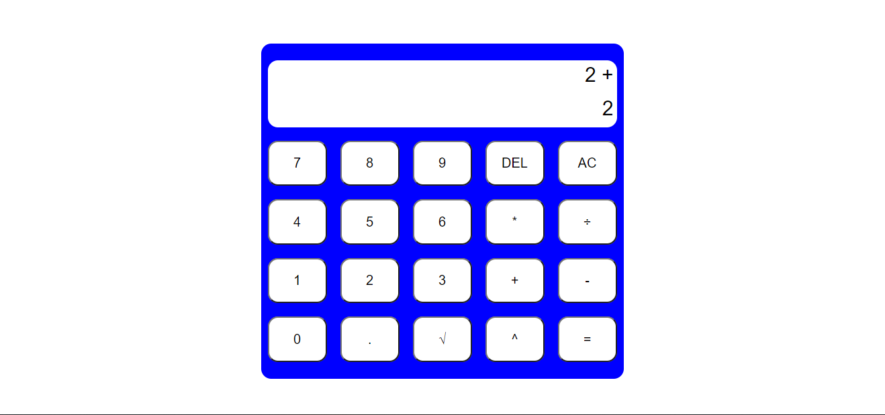
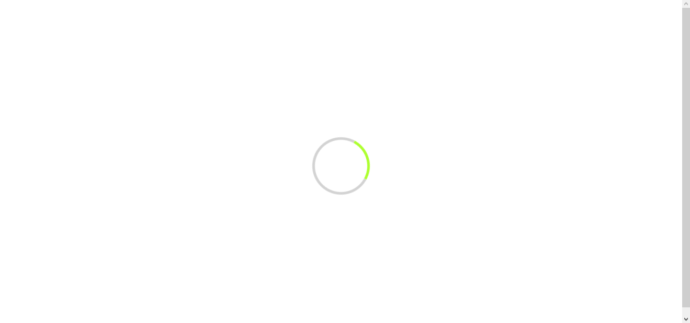
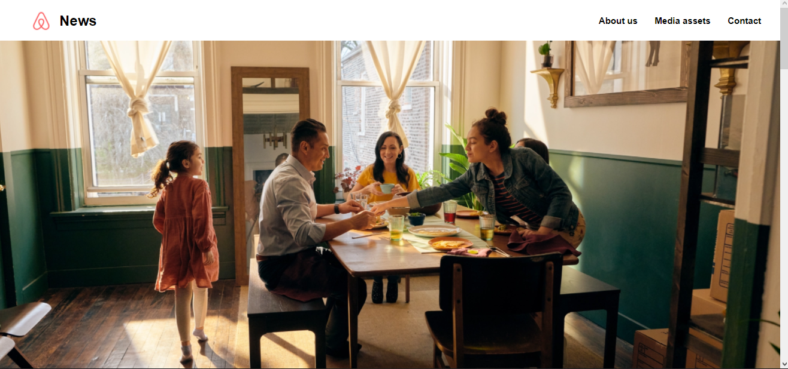

# Portfolio

## Diseño

La verdad que en un primer momento no sabía muy bien como plantearlo, ni como diseñarlo,
entonces decidí buscar por internet algun ejemplo que me pudiera servir como referencia,
despues de buscar y ver bastantes hay dos que tomé como referencia porque su diseño me encantó
son estos dos: 1. http://www.nathaliejankie.nl y 2.http://www.jayvanhutten.com

Para empezar decidí crear el header, que aunque iba a tener el mismo fondo que gran parte del
cuerpo de la página, pense que sería lo mas comodo para estructurarlo todo.

```html
<div id="header">
  <a href="" id="logo">
    <span>Guzmán Suárez - Programador</span>
  </a>
  <div id="links">
    <a
      href="recursos/CV-GuzmanSuarezAlvarez.pdf"
      download="CV-GuzmanSuarezAlvarez.pdf"
      >Curriculum</a
    >
    <a href="contacto.html">Contacto</a>
  </div>
</div>
```

Y luego le di un estilo

```css
#header {
  display: flex;
  padding: 20px 20px 16px 40px;
  justify-content: space-between;
  align-items: center;
}
#header #links a {
  padding: 12px;
  text-decoration: none;
}

#header #links a:hover {
  background-color: lightcoral;
  border-radius: 8px;
}

#header #logo {
  display: flex;
  align-items: center;
  text-decoration: none;
  font-size: 24px;
  font-weight: 600;
}
```

Luego tal y como vi en los otros portfolios, puse mi nombre en grande con una pequeña descripción ademas de
poner cuales son mis puntos fuertes.

```html
<div id="Sobre_mi">
  <h1>Guzmán Suárez</h1>
  <h2>Programador</h2>
  <p>
    ¡Hola! Mi nombre es Guzman Suárez Álvarez. Soy programador y estoy
    terminando mis estudios en desarrollo Multiplataforma. Tengo conocimientos
    en
    <span id="java">JAVA</span>, <span id="web">desarrollo web</span> y
    <span id="sql">SQL</span>. Soy muy apasionado y comprometido con mi trabajo
    <br />
    <br />
    Debajo puedes encontrar algunos de los trabajos que he hecho durante mis
    estudios. Ten en cuenta que estos trabajos han sido agregados unica y
    exclusivamente porque debo poner alguno.
  </p>
</div>
```

Y le di estilo

```css
#Sobre_mi {
  padding-top: 7%;
  padding-left: 30%;
  padding-right: 30%;
  text-align: center;
  margin-top: 40px;
  margin-bottom: 20%;
}

#Sobre_mi h1 {
  font-size: 32px;
  font-weight: 600;
  text-align: center;
}
#Sobre_mi h2 {
  font-size: 25px;
  font-weight: 600;
  text-align: center;
}
#Sobre_mi p {
  margin: 12px auto 16px;
  text-align: left;
  text-shadow: none;
}
#java {
  background-color: darkviolet;
  color: black;
  border-radius: 5px;
}
#web {
  background-color: lightblue;
  color: black;
  border-radius: 5px;
}
#sql {
  background-color: deeppink;
  color: black;
  border-radius: 5px;
}
```

Despues de esto, tenia que añadir algun proyecto que hubiera hecho, pero la verdad que no veía ninguno lo suficientemente
bueno como para ser incluido, asi que como tenia que poner alguno igualmente decidi poner los 3 que mas me habían costado.
Era importante que estuviera que la parte anterior, es decir, mi presentacion, estuviera centrado y que destacase con respecto
del resto de la página, por eso a esta parte le di un tono diferente, más oscuro.

```html
<div id="portfolio">
  <h3>Proyectos</h3>
  <div id="proyectos">
    <div class="proyecto">
      
      <h4>Calculadora</h4>
      <p>
        Uno de los proyectos que tuve que realizar fue una calculadora hecha con
        html, css y JS
      </p>
      <br />
      <a
        href="https://github.com/Guzmansrz/trabajoEntornos.git"
        target="_blank"
      >
        Enlace a github</a
      >
    </div>
    <div class="proyecto">
      
      <h4>Algunas animaciones con CSS</h4>
      <p>Estas son algunas animaciones que tuve que crear</p>
      <br />
      <a href="https://github.com/Guzmansrz/animaciones.git" target="_blank">
        Enlace a github</a
      >
    </div>
    <div class="proyecto">
      
      <h4>Pagina AirBnb</h4>
      <p>En este ejercicio tenia que recrear la pagina web de AirBnb</p>
      <br />
      <a href=" https://github.com/Guzmansrz/airbnb_page.git" target="_blank">
        Enlace a github</a
      >
    </div>
  </div>
</div>
```

Y aqui el estilo que le di

```css
#portfolio {
  padding-top: 60px;
  padding-left: 8%;
  padding-right: 3%;
  background-color: #272626;
}
#portfolio #proyectos {
  display: flex;
  flex-wrap: wrap;
  flex-shrink: 3;
}
#portfolio .proyecto {
  padding: 32px;
  box-sizing: inherit;
  width: 380px;
  height: 440px;
}

#portfolio h4 {
  padding-top: 12px;
  font-weight: 600;
}
#portfolio h3 {
  font-weight: 900;
  padding-bottom: 20px;
}
#portfolio img {
  border-radius: 8px;
  width: 100%;
}

#portfolio img:hover {
  transform: scale(1.05);
}
```

Pensé que seria buena idea agregar en el header un boton que al apretarlo te descargase mi curriculum,
la verdad que dude si hacer eso o hacer qye te redirigiese a otra pagina donde poder verlo.
Y tambien agregue otra pestaña donde poder ver mas facilmente como ponerte en contacto conmigo, la cual está
vacía porque no quiero que nadie se ponga en contacto conmigo por esta página, aun tiene que mejorar mucho y creo
que necesito tener cosas mas importantes y mejores que ponerle
